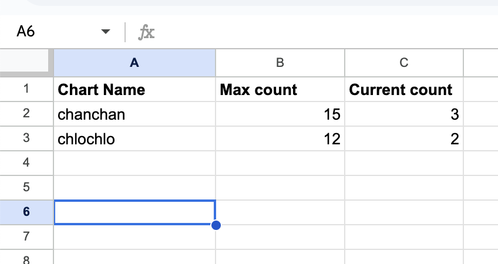
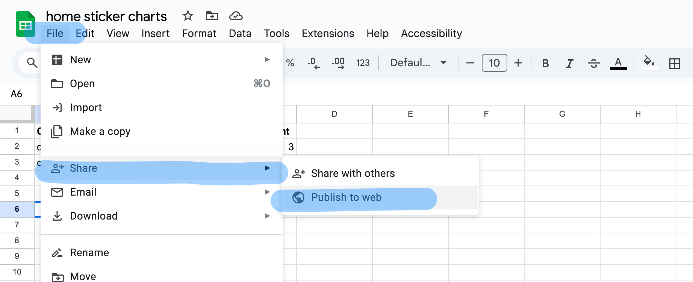
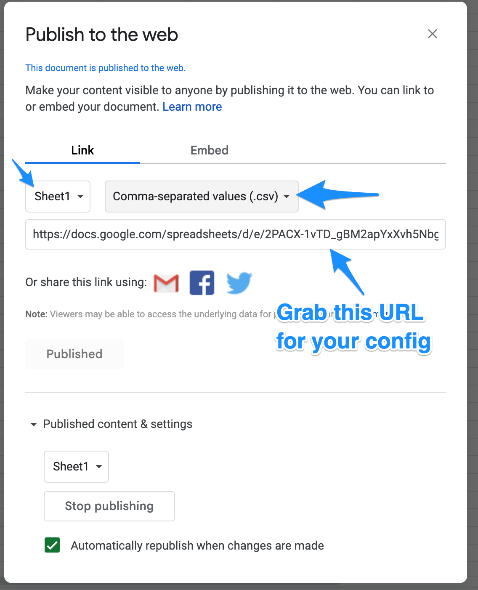

# MMM-StickerChart

A kids motivational Sticker Chart for [MagicMirror2](https://magicmirror.builders/).

> "A sticker chart is a reward system that uses stickers to encourage positive behaviors.
They are also known as behaviour charts, reward charts, or star charts."

    TODO: screenshot the thing running

## Features

* Input: Pulls sticker chart data from a Google Sheets spreadsheet.
* Supports multiple progress charts / multiple children.
* Output: Compact one-line display per progress bar.

## How to Use

To avoid the need to host a server backend, *MMM-StickerChart* uses the simplest database known to man: 
it reads its data from a Google Sheet, where each row is a single progress bar.
A sticker chart progress bar has just three required properties:

* name (or label)
* max value (how many stickers needed to reach the goal)
* current value (how many stickers/points have been collected so far)

That's it!

### Publishing a Data Sheet

Structure your sheet like the following, with one progress bar label per row. The first row (headers) is ignored, its values don't matter.
Only the order of columns matters.



Now, we'll publish this worksheet as CSV to allow our MagicMirror integration to fetch it without any credentials.
This will give you a **secret url** to use in your *MMM-StickerChart* configuration.





### config.js

```js
TODO: config.js example

...
{
    "sheets_url": "https://docs.google.com/spreadsheets/d/e/<SOME_BIG_ID>/pub?gid=0&single=true&output=csv"
}
...
```
